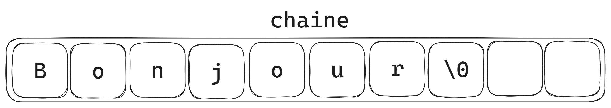

# Les chaînes de caractère

Une chaîne de caractères est une séquence de caractères qui représente du texte. En C, vous pouvez utiliser le type de données **``char``** et le tableau de caractères **``char[]``** pour stocker et manipuler des chaînes de caractères.

> Dans ce cour nous allons utiliser des fonctions qui vous sont interdites dans le cadre de votre Tek1. Néanmoins, vous les avez toutes recodées pendant la piscine _(``size_t strlen(char *str)`` => ``int my_strlen(char *str)``)_. Vous pouvez donc utiliser vos fonctions personnelles pour les exercices.

## Déclaration d'une Chaîne de Caractères

Pour déclarer une chaîne de caractères en C, vous pouvez utiliser le type **``char``** suivi d'un tableau de caractères. Par exemple :

```c
char chaine[10];
```

La variable ``chaine`` est un tableau de 10 caractères. Elle peut contenir 9 caractères et le dernier caractère est le caractère de fin de chaîne '\0'. Ce caractère est très important car il permet de savoir où se termine la chaîne de caractères. Il est automatiquement ajouté à la fin de la chaîne de caractères lors de l'initialisation de la variable. Il est donc inutile de l'ajouter manuellement.

## Initialisation d'une Chaîne de Caractères

Vous pouvez initialiser une chaîne de caractères au moment de la déclaration. Par exemple :

```c
char chaine[10] = "Bonjour";
char chaine2[] = "Hello World!";
```

Lors de la déclaration de ``chaine``, on donne une taille de 10 à la chaîne de caractères. Il est donc possible de stocker 9 caractères et le dernier caractère est le caractère de fin de chaîne ``'\0'``.

Lors de la déclaration de ``chaine2``, on ne donne pas de taille à la chaîne de caractères. La taille de la chaîne de caractères est donc déterminée automatiquement lors de la compilation. Dans cet exemple on stocke donc 12 caractères et le dernier caractère est le caractère de fin de chaîne ``'\0'``.



## Affichage d'une Chaîne de Caractères

Pour afficher une chaîne de caractères en C, vous pouvez utiliser la fonction ``printf()`` ou alors la fonction ``write()``. Par exemple :

```c
char chaine[] = "Bonjour";
printf("Contenu de chaine : %s\n", chaine); // affiche "Contenue de chaine : Bonjour" dans le terminal
write(1, chaine, 7); // affiche "Bonjour" dans le terminal
```

> La spécification ``%s`` dans ``printf`` est utilisée pour afficher une chaîne de caractères.

## Manipulation de Chaînes de Caractères

Pour manipuler des chaînes de caractères en C sans utiliser de pointeurs, vous pouvez accéder à des éléments individuels, parcourir la chaîne et effectuer des opérations de base.

### 1. Accès à un Caractère Spécifique

Pour accéder à un caractère spécifique dans une chaîne, utilisez l'indice de l'élément. Les indices commencent à 0 pour le premier caractère. Par exemple :

```c
char chaine[] = "Hello";
char premierCaractere = chaine[0]; // Accès au premier caractère 'H'
char deuxiemeCaractere = chaine[1]; // Accès au deuxième caractère 'e'
```

### 2. Parcours d'une Chaîne de Caractères

Vous pouvez parcourir une chaîne caractère par caractère à l'aide d'une boucle for ou while. Par exemple :

```c
char chaine[] = "Bonjour";
int longueur = strlen(chaine);

for (int i = 0; i < longueur; i++) {
    write(1, &chaine[i], 1);
}
```

> Cela affichera chaque caractère de la chaîne un par un.

Comme nous l'avaons vu précédement une chaine de caractère se termine toujours par le caractère 0 ``\0``. Il n'est donc pas necessaire de connaitre la taille de la chaine pour la parcourir. Par exemple :

```c
char chaine[] = "Bonjour";

for (int i = 0; chaine[i] != '\0'; i++) {
    write(1, &chaine[i], 1);
}
```

> Dans cet exemple on parcourt la chaine de caractère jusqu'à ce qu'on arrive au caractère de fin de chaine ``\0``.

### 3. Modification d'une Chaîne de Caractères

Pour modifier un caractère dans une chaîne, vous pouvez simplement utiliser l'indice _(avec les caractère ``[]``)_ pour accéder à l'élément et le modifier. Par exemple :

```c
char maChaine[] = "Bonjour";
maChaine[0] = 'C';
```

> Dans cet exemple on remplace le premier caractère de la chaine ``B`` par ``C``.

### 4. Longueur d'une Chaîne de Caractères

Pour obtenir la longueur d'une chaîne, vous pouvez utiliser la fonction ``strlen`` de la bibliothèque ``<string.h>``. Par exemple :

```c
char maChaine[] = "Bonjour";
int longueur = strlen(maChaine);
printf("Longueur de maChaine : %d\n", longueur);
```

### 5. Comparaison de Chaînes de Caractères

Pour comparer deux chaînes de caractères, vous pouvez utiliser la fonction ``strcmp`` de la bibliothèque ``<string.h>``. Par exemple :

```c
char str1[] = "abc";
char str2[] = "def";
int resultat = strcmp(str1, str2);

if (resultat == 0) {
    printf("str1 est égal à str2\n");
} else if (resultat < 0) {
    printf("Dans l'ordre alphabétique str1 est avant str2\n");
} else {
    printf("Dans l'ordre alphabétique str2 est avant str1\n");
}
```

### 6. Recherche de Sous-chaînes

Pour rechercher une sous-chaîne dans une chaîne, vous pouvez utiliser plusieur boucles for imbriquées. Par exemple :

```c
char phrase[] = "La programmation en C est puissante.";
char sousChaine[] = "programmation";
int i = 0;
int j = 0;

for (i = 0; phrase[i] != '\0'; i++) {
    for (j = 0; sousChaine[j] != '\0'; j++) {
        if (phrase[i + j] != sousChaine[j]) {
            break;
        }
    }

    if (sousChaine[j] == '\0') {
        printf("Sous-chaîne trouvée à l'indice %d : %s\n", i, sousChaine);
        break;
    }
}
```

> Ce programme est un peu plus complexe que les autres. Il parcourt la chaîne de caractères ``phrase`` et compare chaque caractère avec le premier caractère de la sous-chaîne ``sousChaine``. Si les caractères correspondent, il continue à comparer les caractères suivants de la chaîne et de la sous-chaîne. Si les caractères ne correspondent pas, il passe au caractère suivant de la chaîne. Si tous les caractères correspondent, il affiche l'indice de la sous-chaîne dans la chaîne.

> Cette manipulation peu etre simplifiée en utilisant la fonction ``strstr`` de la bibliothèque ``<string.h>``.

## Caractères Spéciaux dans les Chaînes de Caractères en C

Les chaînes de caractères en C peuvent contenir des caractères spéciaux qui ont une signification particulière. Ces caractères sont précédés d'un caractère d'échappement (backslash, ``'\'``) pour les distinguer des caractères normaux. Voici quelques-uns des caractères spéciaux les plus couramment utilisés :

### 1. ``\n`` - Saut de Ligne

Le caractère ``'\n'`` est utilisé pour représenter un saut de ligne. Lorsqu'il est inclus dans une chaîne de caractères, il provoque le passage à la ligne suivante lors de l'affichage ou de l'impression.

Exemple :

```c
printf("Première ligne\nDeuxième ligne");
```

Résultat :

```txt
Première ligne
Deuxième ligne
```

### 2. ``'\t'`` - Tabulation

Le caractère ``'\t'`` est utilisé pour représenter une tabulation horizontale. Il insère un espacement équivalent à une tabulation.

Exemple :

```c
printf("Colonne 1\tColonne 2");
```

Résultat :

```txt
Colonne 1    Colonne 2
```

### 3. ``'\\'`` - Caractère d'Echappement

Pour représenter un caractère d'échappement lui-même dans une chaîne, vous devez utiliser ``\``. Cela évite que le caractère soit interprété comme un caractère spécial.

Exemple :

```c
printf("Ceci est une barre oblique inversée : \\");
```

Résultat :

```txt
Ceci est une barre oblique inversée : \
```

### 4. ``'\"'`` - Guillemets Doubles

Pour inclure des guillemets doubles dans une chaîne de caractères, utilisez ``'\"'``. Cela permet d'éviter que les guillemets soient interprétés comme la fin de la chaîne.

Exemple :

```c
printf("Ceci est une chaîne avec des guillemets : \"exemple\"");
```

Résultat :

```txt
Ceci est une chaîne avec des guillemets : "exemple"
```

### 5. ``'\r'`` - Retour de Charriage

Le caractère ``'\r'`` représente un retour de charriage (carriage return). Il peut être utilisé pour retourner le curseur au début de la ligne.

> Il a le meme effet que de faire ``\n`` puis ``\b``.

> Il peut etre interpréter comme le renvois de la pointe d'une machine à écrire à son point de départ.


### 6. ``'\b'`` - Retour Arrière

Le caractère ``'\b'`` représente un retour arrière (backspace) et est utilisé pour déplacer le curseur d'un caractère vers la gauche.

C'est ce caractère qui est utilisé pour effacer un caractère dans un terminal.

Ces caractères spéciaux sont utiles pour formater et structurer le texte dans les chaînes de caractères en C, que ce soit pour l'affichage à l'écran, le stockage de données ou d'autres opérations de traitement de texte.

## Conclusion

Les chaînes de caractères en C sont un moyen important de travailler avec du texte. Vous pouvez les déclarer, les initialiser, les afficher, les manipuler et les modifier en utilisant le type ``char`` et les tableaux de caractères ``char[]``. Cependant, faites attention aux débordements de tableaux pour éviter les erreurs.
